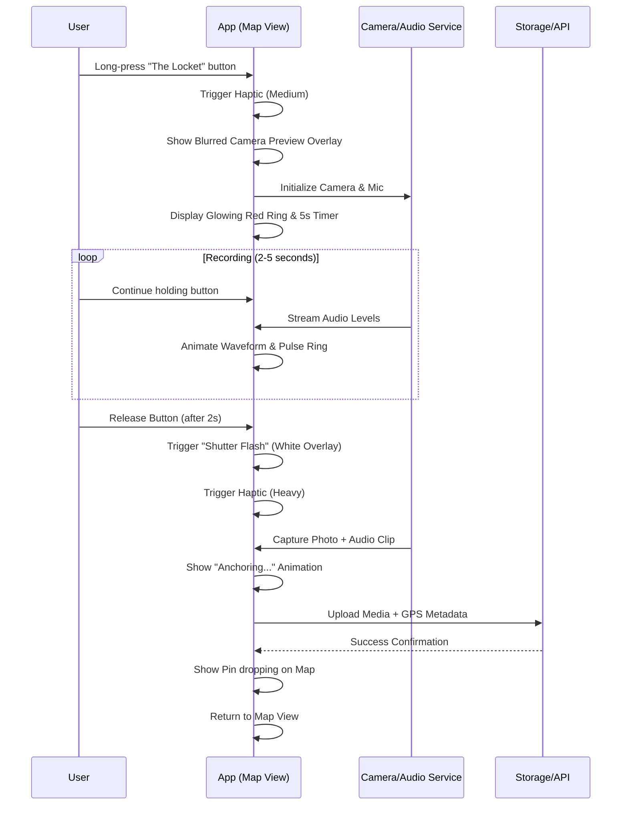
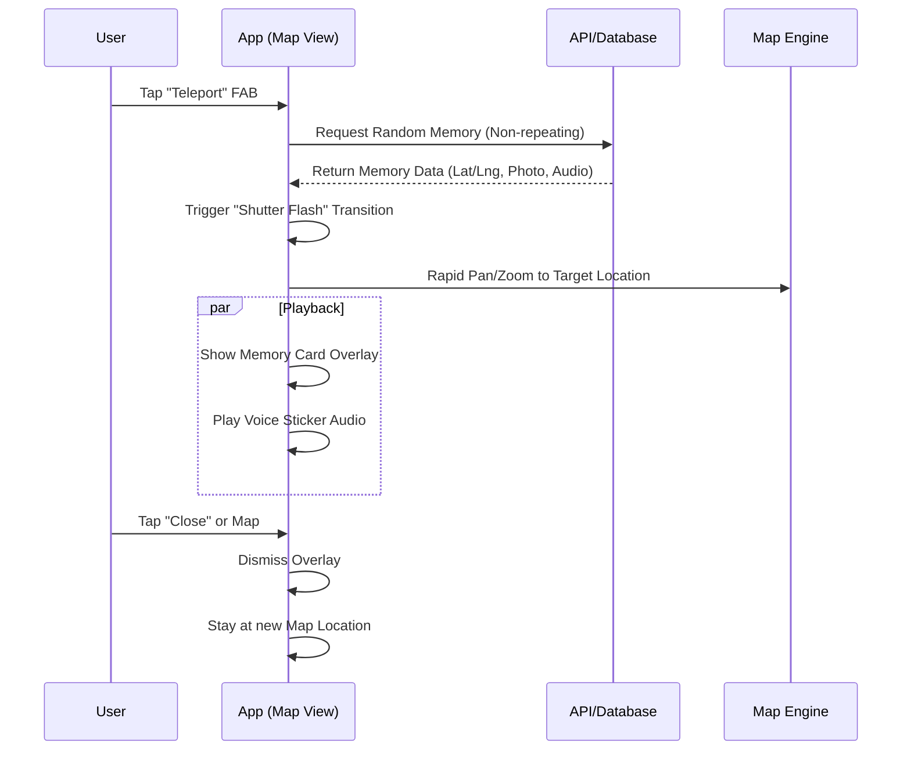
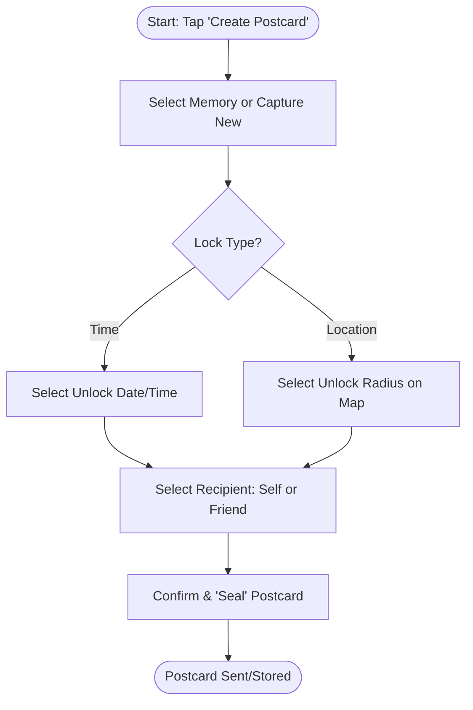

# Life Mapped - User Flow Specifications

This document details the step-by-step interactions for the core "magic moments" of the Life Mapped experience.

---

## 1. The Locket Ritual (Capture Flow)

The "Locket Ritual" is the primary way users capture memories. It is designed to be intentional, tactile, and rewarding.

### Key Interaction States:

- **Pre-Capture:** Map is active, Locket button is idle.
- **Active Recording:** Screen is focused on the ritual; map is obscured.
- **Post-Capture:** Brief "success" state before returning to the map.

---

## 2. The Teleport Experience (Discovery Flow)

Teleportation is the serendipitous way users rediscover their past.

### Key Interaction States:

- **The Jump:** The high-speed map movement combined with the visual flash.
- **The Reveal:** The moment the audio starts playing and the photo appears.

---

## 3. Time-Locked Postcard (Sending Flow)

Creating a "gift" for the future or a friend.

### Key Interaction States:

- **The Seal:** A satisfying animation (like closing a locket or wax seal) to confirm the lock.
- **The Locked State:** Recipient sees a "Locked" placeholder until conditions are met.
