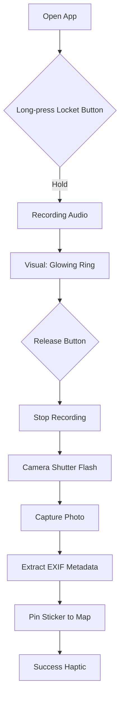
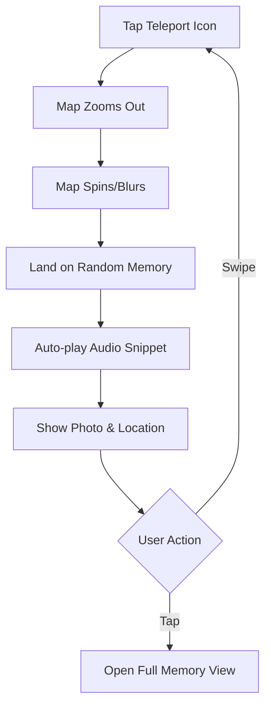
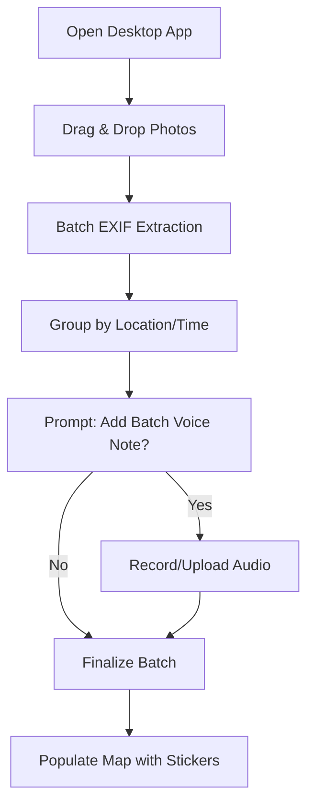

# UX Design Specification se122-image-sharing-social-media

**Author:** DELL
**Date:** 2025-12-19T12:00:00Z

---

<!-- UX design content will be appended sequentially through collaborative workflow steps -->

## Executive Summary

### Project Vision

Life Mapped is a private-first "memory preservation tool" centered on the "Locket Metaphor." It anchors intimate life moments (photos + 2-5s "Voice Stickers") to geographic locations on a beautiful, living map. It prioritizes human agency, intimacy, and beauty over social performance, creating a sacred space for personal reflection and serendipitous rediscovery.

### Target Users

The primary audience is "Nostalgic Nomads" (20-35)—reflective, private individuals who have experienced significant life transitions (moving, studying abroad) and want to track their emotional trajectory. They value long-term meaning and personal connection over instant novelty or public reach.

### Key Design Challenges

- **Balancing Privacy with Sharing:** Designing "Time-locked Postcards" to feel secure and intimate while allowing for controlled sharing with trusted friends.
- **Minimizing Audio Friction:** Ensuring the 2-5s voice recording "ritual" feels like a rewarding gift of self-reflection rather than a chore during the upload process.
- **Managing Map Density:** Maintaining the "Beauty as Utility" principle on the map even as the number of memory pins grows in specific locations.

### Design Opportunities

- **Signature Sensory Branding:** Utilizing the 0.2s "Shutter Flash" transition during teleportation to create a unique, memorable brand moment.
- **Generative Placeholders:** Creating beautiful, unique visuals for "Voice-only" pins to maintain the map's aesthetic integrity.
- **Serendipitous Rediscovery:** Leveraging the "Teleport" mechanic to turn memory browsing into a gift of unexpected emotional resonance.

## Core User Experience

### Defining Experience

The heart of Life Mapped is the **"Voice Sticker" Capture**. It is the atomic unit of memory—a 2-5 second audio clip attached to a photo and a location. The experience is designed to be a "gift to your future self," focusing on the emotional resonance of the moment rather than social validation.

### Platform Strategy

- **End-User App (React Native):** Multi-platform (iOS/Android) experience focused on "On-the-go Capture" and "Living Map" exploration.
- **Admin/Moderation App (Web):** Desktop-optimized dashboard for system health, content moderation, and user management.
- **Desktop (Web):** Focused on the "Bulk-Drop Wall" for importing historical clusters and large-scale map exploration.

### Effortless Interactions

- **One-Tap Recording:** A simple "hold to record" interaction that eliminates menu fatigue. See [user-flows.md](user-flows.md) for the detailed "Locket Ritual."
- **Automatic Anchoring:** Leveraging EXIF data to automatically place memories on the map, requiring zero manual input for location.
- **Drag-and-Drop Clusters:** A fluid "Bulk-Drop" interaction that makes importing dozens of photos feel like a single, cohesive ritual.

### Critical Success Moments

- **The First Teleport:** The moment a user is jumped to a random past memory and hears their own voice from that time/place.
- **The "Anchored" Ping:** The satisfying visual and haptic confirmation that a memory has been safely stored in the "Locket."

### Experience Principles

- **Low-Friction Capture:** Recording should feel like a natural extension of the moment, not a task.
- **Beauty as Utility:** The map is a living art piece; every interaction should enhance its aesthetic value.
- **Private by Default:** Intimacy is the priority; sharing is a conscious, meaningful act.
- **Serendipity over Search:** Discovery is a gift of surprise, moving "backward into meaning."

## Desired Emotional Response

### Primary Emotional Goals

- **Nostalgic Resonance:** A warm, slightly bittersweet feeling of connecting with a past version of oneself.
- **Serendipitous Delight:** The "gift" of finding a memory you forgot you had.
- **Sacred Privacy:** A deep sense of safety and ownership—the feeling of a "Locket" that only you (or those you choose) can open.

### Emotional Journey Mapping

- **First Discovery:** Curiosity and a sense of "finally, a place for _me_."
- **During Capture:** Reflective and intentional. The 2-5s recording should feel like a quiet moment of mindfulness.
- **During Teleportation:** Anticipation followed by a "shiver" of emotional connection.
- **When Something Goes Wrong:** Reassurance. If an upload fails, the system should feel like a helpful companion, not a cold machine.

### Micro-Emotions

- **Intimacy vs. Performance:** Users should feel _intimate_ with their memories, never like they are _performing_ for an audience.
- **Anchored vs. Lost:** The map provides a sense of being "anchored" in time and space.

### Design Implications

- **Nostalgia:** Use of soft transitions, the signature "Shutter Flash," and a "Beauty as Utility" aesthetic (e.g., watercolor or minimalist dark mode).
- **Safety:** Clear, human-centric privacy language and a UI that feels "enclosed" and personal.
- **Delight:** The "Teleport" button should have a slightly magical, tactile feel.

### Emotional Design Principles

- **The "Shiver" Factor:** Every interaction should aim for that small moment of emotional resonance.
- **Quiet Design:** The UI should step back to let the memory (photo + voice) take center stage.
- **Human-Centric Feedback:** Error messages and system states should use empathetic, non-technical language.

## UX Pattern Analysis & Inspiration

### Inspiring Products Analysis

- **BeReal:** For its "unfiltered" and "moment-in-time" capture. It removes the pressure of perfection, which aligns with our "Voice Sticker" ritual.
- **Fog of World / Zenly:** For the "Map as a Game/Art" feel. These apps make geographic exploration feel rewarding and visually stunning.
- **Day One:** For the "Sacred Journal" intimacy. It builds trust through privacy and a clean, focused UI.

### Transferable UX Patterns

- **Navigation:** A "Map-First" hierarchy where the map is the canvas, and UI elements (like the Teleport button) float elegantly on top.
- **Interaction:** The "Hold to Record" pattern from messaging apps (like WhatsApp/Telegram) for our Voice Stickers—it's already in our users' muscle memory.
- **Visuals:** Using "Depth and Layers" (like glassmorphism) to make the UI feel like it's floating over the map, maintaining the "Locket" metaphor.

### Anti-Patterns to Avoid

- **Infinite Feeds:** We want to avoid the "doomscrolling" feeling. Our discovery is through the map and teleportation, not a vertical list.
- **Complex Onboarding:** If it takes more than 30 seconds to record the first memory, we've lost the "low-friction" goal.
- **Over-Categorization:** Don't force users to tag everything. Let the EXIF data and the voice clip be the primary metadata.

### Design Inspiration Strategy

- **Adopt:** The "Hold to Record" interaction for Voice Stickers.
- **Adapt:** The "Map Exploration" mechanics from travel apps, but simplify them to focus on _memories_ rather than _points of interest_.
- **Avoid:** Social performance metrics (likes, view counts) that create pressure.

## Design System Foundation

### 1.1 Design System Choice

**Themeable System (Tailwind CSS + Headless UI/Radix)**

### Rationale for Selection

- **Speed vs. Uniqueness:** Allows for rapid PWA development while providing the flexibility to create a completely custom "Locket" aesthetic.
- **Map-Centric UI:** Tailwind's utility-first approach is ideal for building floating, glassmorphic elements that sit over a dynamic map.
- **Mobile-First:** Perfect for ensuring the "On-the-go Capture" experience is seamless across devices.

### Implementation Approach

- **Headless Components:** Use Radix or Headless UI for accessible, unstyled components (modals, popovers) and skin them with Tailwind.
- **Custom Map Layer:** Build a custom UI layer that interacts with the map library (e.g., Mapbox or Leaflet).

### Customization Strategy

- **Design Tokens:** Define a custom palette of soft, nostalgic colors and elegant typography.
- **Signature Components:** Custom-build the "Teleport" button and "Voice Sticker" recorder to ensure they feel magical and tactile.

## 2. Core User Experience

### 2.1 Defining Experience

The defining experience of Life Mapped is **"Anchoring a Voice Sticker."** It's the core interaction where a user pins a 2-5 second audio memory to a specific location and photo. It's described as "pinning a whisper to a place," focusing on personal preservation over social sharing.

### 2.2 User Mental Model

- **The Physical Locket:** A private, tactile, and precious space for keeping memories safe.
- **The Travel Journal:** A reflective tool for tracking one's emotional and geographic journey.
- **Shift from Performance to Preservation:** Moving away from the "sharing for others" model of Instagram towards a "preserving for self" model.

### 2.3 Success Criteria

- **"The Shiver":** A small spark of emotional resonance when hearing a voice clip played back.
- **Zero-Effort Placement:** Automatic location anchoring using EXIF data, requiring no manual address entry.
- **Tactile Feedback:** The recording interaction feels "heavy" and meaningful, providing a sense of physical permanence.

### 2.4 Novel UX Patterns

- **The "Shutter Flash":** A 0.2s visual transition that simulates a camera shutter, providing sensory confirmation of a captured memory.
- **The "Teleport" Mechanic:** A serendipitous jump to a random past memory, turning browsing into a gift of discovery.

### 2.5 Experience Mechanics

1.  **Initiation:** User drags a photo onto the map or taps the "Add Memory" FAB.
2.  **Interaction:** A "Locket" UI expands; the user **holds** the central button to record. A circular progress ring fills over 2-5 seconds.
3.  **Feedback:** A soft waveform pulses during recording; a "Shutter Flash" occurs upon release.
4.  **Completion:** The locket "snaps" shut, and a pin "pings" onto the map at the extracted location.

## Visual Design Foundation

### Color System

- **Primary:** "Locket Gold" (#D4AF37) or "Ink Blue" (#1B365D) for key actions and branding.
- **Backgrounds:** "Parchment" (#F5F5DC) for a warm, journal-like feel, or "Midnight" (#0F172A) for a focused dark mode.
- **Accents:** Muted, nostalgic tones (Sage Green, Dusty Rose) for categorizing different memory types.
- **Accessibility:** All color pairings will meet WCAG AA standards for contrast.

### Typography System

- **Headings:** _Playfair Display_ or _EB Garamond_ (Serif) to evoke a timeless, personal journal aesthetic.
- **Body/UI:** _Inter_ or _Geist_ (Sans-serif) for high legibility and modern PWA performance.
- **Hierarchy:** A clear type scale (8px base) to ensure information is easy to scan and digest.

### Spacing & Layout Foundation

- **Feel:** Airy and spacious, allowing the map to remain the primary focus.
- **Base Unit:** 8px grid system for consistent spacing and alignment.
- **Layout:** "Floating Canvas" approach where UI elements use glassmorphism (blur + transparency) to sit elegantly over the map.

### Accessibility Considerations

- **Touch Targets:** Minimum 44x44px for all interactive elements on mobile.
- **Screen Readers:** Semantic HTML and ARIA labels for all custom components (like the Voice Sticker recorder).
- **Motion:** Support for `prefers-reduced-motion` to ensure the "Shutter Flash" and transitions are comfortable for all users.

## 9. Design Direction Decision

After exploring four distinct visual directions, we have selected **Direction 2: The Modern Locket** as the primary design language for Life Mapped.

### Selected Direction: The Modern Locket

This direction best aligns with the 'Private Vault' and 'Digital Heirloom' goals while maintaining a high-performance, modern PWA feel.

- **Visual Language:** Glassmorphism, deep midnight backgrounds, and 'Ink Blue' accents.
- **Typography:** Geist (Sans-serif) for a technical yet approachable feel.
- **Key UI Element:** The 'Locket Button'—a central, glowing action button that serves as the primary capture trigger.
- **Metaphor:** A high-tech digital vault that feels secure, premium, and personal.

### Design Artifacts

- [Visual Direction Mockups](ux-design-directions.html)

## 10. User Journey Flows

We have mapped the critical user journeys to ensure the 'Locket' metaphor translates into seamless interactions.

### Journey 1: The Voice Sticker Ritual (Mobile Capture)

The primary way users preserve a moment. Focus on speed and tactile feedback.

### Journey 2: Teleportation (Serendipitous Discovery)

The primary way users re-experience their memories.

### Journey 3: The Bulk-Drop Wall (Desktop Organization)

Optimized for large-scale memory management.

## 11. Component Strategy

Our component strategy leverages **Tailwind CSS** for styling and **Headless UI/Radix** for accessible interaction patterns, supplemented by custom components for the unique 'Locket' experience.

### Custom Component Specifications

#### 1. The Locket Button

**Purpose:** The central, high-intent capture trigger for the Voice Sticker ritual.

- **Anatomy:** A large circular button with a glassmorphic base and a glowing 'Ink Blue' core.
- **States:**
  - **Idle:** Subtle breathing pulse; indicates readiness.
  - **Recording (Active):** Inner ring turns 'Alert Red'; outer glow expands/contracts with audio volume.
  - **Success:** Brief green flash ('Shutter Flash') followed by a haptic 'thump'.
- **Accessibility:** `aria-label="Record Voice Sticker"`, `aria-live="polite"` for recording status.

#### 2. The Voice Sticker (Map Marker)

**Purpose:** A visual representation of a memory pinned to the geographic map.

- **Anatomy:** A circular thumbnail of the captured photo with a subtle audio-wave icon overlay.
- **States:**
  - **Default:** 48px diameter thumbnail with a white border.
  - **Active/Playing:** Expands to 64px; audio-wave icon animates; location/date label appears below.
- **Accessibility:** `aria-label="Memory at [Location] on [Date]"`.

#### 3. The Teleport Button

**Purpose:** Triggers the serendipitous discovery mechanic.

- **Anatomy:** A floating action button (FAB) with a compass/star icon.
- **States:**
  - **Idle:** Static icon in the bottom-right corner.
  - **Active:** Spins rapidly while the map performs the 'Teleport' zoom/pan animation.
- **Accessibility:** `aria-label="Teleport to a random memory"`.

## 12. UX Consistency Patterns

To ensure a cohesive experience across mobile and desktop, we have established the following interaction patterns.

### Button Hierarchy & Actions

- **Primary (The Locket):** Floating, circular, glowing. Reserved exclusively for the 'Voice Sticker Ritual'.
- **Secondary (Utility):** Glassmorphic buttons with clear iconography (e.g., Teleport, Filter, Search).
- **Tertiary (System):** Ghost buttons for low-priority actions like 'Settings' or 'Logout'.

### Feedback & Rituals

- **The Shutter Flash:** A brief (200ms) white opacity flash across the screen to signal a successful capture.
- **Haptic Confirmation:** A 'heavy' haptic tap on mobile devices upon pinning a sticker.
- **Error State:** If capture fails (e.g., no GPS), the Locket button pulses red, and a toast notification appears at the top of the screen.

### Navigation & Layout

- **Mobile (PWA):** A bottom-docked navigation bar for quick access to 'Map', 'Wall' (Gallery), and 'Profile'.
- **Desktop:** A collapsible left-hand sidebar for navigation, keeping the Map as the primary expansive canvas.

### Empty States

- **New Map:** "Your map is a blank canvas. Hold the Locket to pin your first memory."
- **No Search Results:** "No memories found in this area. Try teleporting to a new location?"

## 13. Responsive Design & Accessibility

Life Mapped is designed to be a seamless PWA that adapts its core 'Locket' experience to the strengths of each device.

### Responsive Strategy

- **Mobile (Capture-First):** Optimized for one-handed use. The 'Locket' button is fixed at the bottom center. The Map is the primary full-screen interface.
- **Tablet (Discovery-First):** Uses a split-pane view. The Map occupies 60% of the screen, while the 'Wall' (Gallery) provides a scrollable list of memories on the right.
- **Desktop (Management-First):** A multi-column layout. A persistent sidebar handles navigation and filtering, the Map serves as the central canvas, and a 'Detail Panel' slides in from the right for deep-diving into specific memories.

### Breakpoint Strategy

We utilize standard Tailwind CSS breakpoints to ensure consistency:

- **Mobile:** < 768px (Single column, bottom nav)
- **Tablet:** 768px - 1024px (Split-pane, side nav)
- **Desktop:** > 1024px (Multi-column, persistent sidebar)

### Accessibility Compliance (WCAG 2.1 AA)

- **Visual:** All text on glassmorphic backgrounds must maintain a minimum contrast ratio of 4.5:1. We use semi-opaque backdrops to ensure legibility over complex map tiles.
- **Interaction:** Full keyboard navigation for the Map and Stickers. Users can 'Tab' through memories and use 'Enter' to play audio.
- **Motion:** If `prefers-reduced-motion` is detected, the 'Teleport' spin animation is replaced with a simple cross-fade, and the 'Shutter Flash' is disabled.
- **Screen Readers:** Every Voice Sticker includes a descriptive ARIA label: `"Memory at [Location], [Duration] audio, captured [Date]"`.
