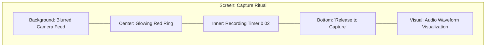
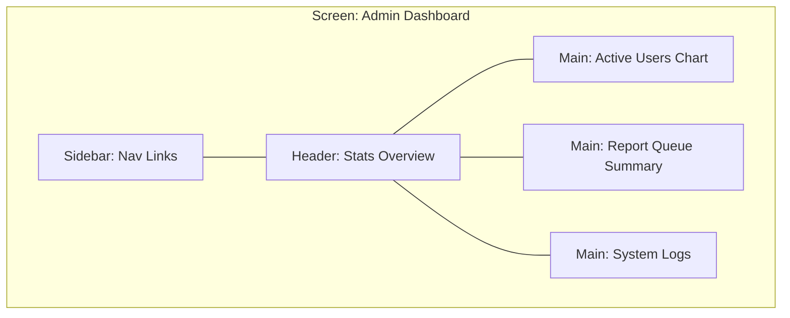

# Life Mapped - Wireframe Specifications

This document outlines the low-fidelity wireframes for the core screens of Life Mapped, separated into the End-User App and the Admin/Moderation App.

## 1. End-User App (React Native)

The primary interface for capturing and rediscovering memories.

### 1.1 The Map View

The central hub for discovery and capture. Includes the "Teleport" FAB for serendipitous discovery (see [user-flows.md](user-flows.md#2-the-teleport-experience-discovery-flow)).

```mermaid
graph TD
    subgraph "Screen: Map View (Mobile)"
    A[Top Bar: Search & Filter] --- B[Main Canvas: Interactive Map]
    B --- C[Pinned Voice Sticker: Thumbnail + Waveform]
    B --- D[Pinned Voice Sticker: Thumbnail]
    B --- E[Floating Action: Teleport Button - Bottom Right]
    B --- F[Primary Action: THE LOCKET - Bottom Center]
    B --- G[Nav Bar: Map | Wall | Profile]
    end
```

### 1.2 The Locket Ritual (Active Capture)

The overlay that appears during the long-press interaction. For the step-by-step interaction logic, see [user-flows.md](user-flows.md#1-the-locket-ritual-capture-flow).



## 2. Admin/Moderation App (Web)

The interface for managing system safety and health.

### 2.1 Admin Dashboard

High-level metrics and system status.


